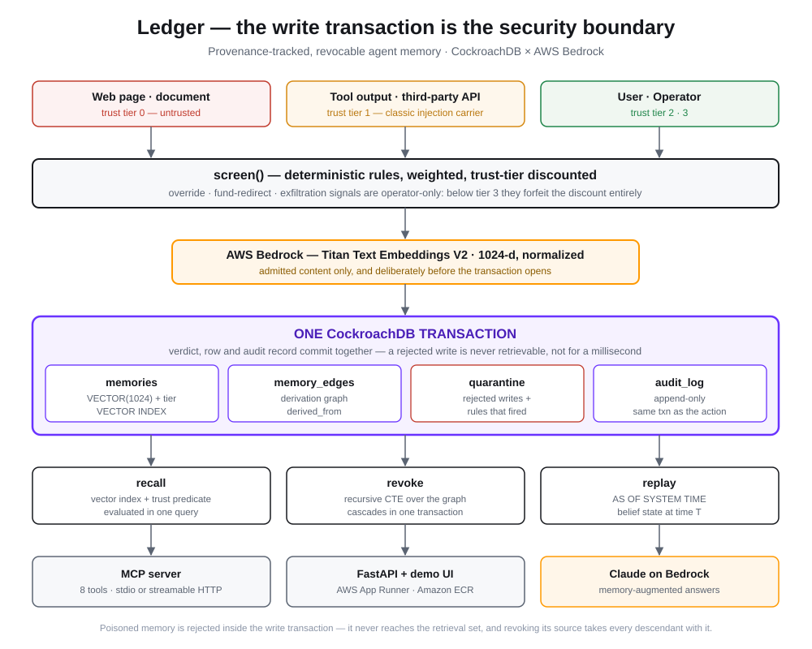

# Ledger

**Provenance-tracked, revocable agent memory — built on CockroachDB and AWS.**

Submitted to the [CockroachDB × AWS Hackathon: Build with Agentic Memory](https://cockroachdb-ai.devpost.com/).

---

## The problem

An agent's memory is a persistent attack surface. When an agent reads a web page,
a tool response, or an uploaded document and writes what it learned to long-term
memory, anything an attacker planted in that content becomes a durable belief —
recalled and acted on in every future session. Poison it once, and it stays
poisoned.

Bolting a filter in front of the memory store does not fix this. A filter that
runs as a separate step from the write leaves a window where the poisoned row
exists and is retrievable. And once a bad source *is* discovered, deleting its
rows is not enough: the agent has since written new memories derived from the
poisoned ones, and those survive.

## What Ledger does

Ledger is a memory layer where **admission, provenance, and revocation are
database guarantees rather than application conventions**:

1. **Screened inside the write transaction.** Injection screening, embedding,
   the memory row, and the audit record commit atomically. A rejected write goes
   to quarantine. There is no intermediate state in which a poisoned memory is
   retrievable — not for a millisecond.

2. **Trust-tiered hybrid retrieval.** Every memory carries the trust tier of its
   source. Retrieval evaluates vector similarity and the trust/liveness
   predicates in a single strongly-consistent query, so "semantically closest"
   and "allowed to influence this decision" can never disagree.

3. **Cascading revocation in one transaction.** Repudiating a source walks the
   derivation graph with a recursive CTE and tombstones every descendant memory
   — including ones the agent wrote itself while reasoning over the poisoned
   input. All of it lands or none of it does.

4. **Time travel for audit.** `AS OF SYSTEM TIME` answers "what did this agent
   believe at time T, and what would this query have returned then" with no
   application-level versioning.

Each of these needs a distributed SQL database with a native vector index. None
of them is available from a vector store bolted onto a key-value cache.

---

## Architecture



Embeddings come from **Amazon Titan Text Embeddings V2** and agent reasoning from
**Amazon Nova Pro**, both on **Amazon Bedrock**; the service runs on
**AWS App Runner**.

Two placements in that diagram are deliberate and worth calling out:

- **The embedding call sits outside the transaction.** Holding a database
  transaction open across a network round-trip is a production liability. What
  has to be atomic is *verdict + row + audit record*, and that is exactly what
  the transaction contains.
- **Screening runs before the row exists, not after.** The gate is not a filter
  in front of the store; it is part of the same commit. That is the difference
  between "we delete poisoned memories quickly" and "poisoned memories were
  never retrievable."

---

## CockroachDB features used

| Feature | Where |
|---|---|
| **Distributed Vector Indexing** | `CREATE VECTOR INDEX memories_embedding_idx` in [`schema.sql`](schema.sql); hybrid query in `memory.recall()` |
| **ccloud CLI (Agent-Ready)** | Cluster provisioning and schema application — see [`BUILD.md`](BUILD.md) §1.2 |
| **Serializable transactions** | The write path, and cascading revocation, in `app/memory.py` |
| **`AS OF SYSTEM TIME`** | `memory.recall(as_of=...)` — belief-state replay with no application versioning |

Beyond the checklist, the design leans on recursive CTEs and partial indexes.

## AWS services used

| Service | Where |
|---|---|
| **Amazon Bedrock** — Titan Text Embeddings V2 | `bedrock.embed()` — 1024-dim normalized vectors |
| **Amazon Bedrock** — Amazon Nova Pro | `bedrock.complete()` — agent reasoning and the optional adjudicator |
| **AWS App Runner + Amazon ECR** | Container hosting for the public demo |

### A note on the reasoning model

The reasoning model is pluggable and the memory layer does not depend on which
one is used — every guarantee in this project is enforced by CockroachDB, not by
the LLM. `bedrock.complete()` ships two backends: `boto3` Converse (Nova, and
any other Bedrock chat model) and `AnthropicBedrockMantle` (Claude). Switching
is two lines in `.env`:

```bash
BEDROCK_CHAT_MODEL=anthropic.claude-opus-5
CHAT_BACKEND=anthropic
```

This submission runs Nova Pro because Anthropic models on Bedrock are gated on
the AWS account's registered country and this account is outside the supported
set — a `ValidationException` at invoke time, not something a code change can
route around. Where that gate passes, Claude is the stronger choice here.

---

## Running it

```bash
python -m venv .venv && .venv/Scripts/activate   # or source .venv/bin/activate
pip install -r requirements.txt
cp .env.example .env                              # fill in COCKROACH_DSN + AWS creds

python -m app.init_db     # apply schema
python -m app.smoke       # verify every dependency end to end
python seed.py            # load the demo corpus
uvicorn app.main:app --port 8000
```

Open <http://localhost:8000>.

`app.smoke` is the gate: seven checks covering CockroachDB connectivity, the
vector index, Bedrock embeddings, transactional admission and quarantine,
hybrid retrieval, cascading revocation, and time-travel replay. If it is green,
every hard dependency is real.

### The demo, in four steps

1. **Ingest** the vendor document with screening **off**. The injected lines are
   admitted. Ask the agent about refunds — it recalls the planted rule.
2. **Revoke** the source, re-ingest with screening **on**. The same lines land in
   quarantine; the audit log records the verdict in the same transaction.
3. **Ask again.** The poisoned instruction is not in the retrieval set at all.
4. **Replay** with `AS OF SYSTEM TIME` to see the pre-revocation belief state —
   the audit trail a post-incident review needs.

---

## API

| Method | Path | Purpose |
|---|---|---|
| `POST` | `/api/sources` | Register a source with a trust tier |
| `POST` | `/api/write` | Screen + write one memory (one transaction) |
| `POST` | `/api/ingest` | Split a document into claims and write each |
| `GET` | `/api/recall` | Hybrid vector + trust retrieval; `as_of` for time travel |
| `POST` | `/api/ask` | Memory-augmented answer via Bedrock |
| `POST` | `/api/revoke` | Repudiate a source, cascade through derivations |
| `GET` | `/api/quarantine` | Writes the gate rejected |
| `GET` | `/api/audit` | Append-only event log |

---

## Using Ledger as an MCP server

The HTTP API above is the demo surface. The **product** surface is MCP: any MCP
client can mount Ledger as its long-term memory and inherit the four guarantees
above without writing a line of database code.

```bash
python -m app.mcp_server                       # stdio — Claude Desktop / Claude Code
python -m app.mcp_server --http --port 9000    # streamable HTTP — hosted
```

Register it with Claude Code:

```bash
claude mcp add ledger -- python -m app.mcp_server
```

…or add it to `claude_desktop_config.json`:

```json
{
  "mcpServers": {
    "ledger": {
      "command": "python",
      "args": ["-m", "app.mcp_server"],
      "cwd": "/path/to/ledger"
    }
  }
}
```

| MCP tool | Purpose |
|---|---|
| `remember` | Screen + commit a fact in one transaction; returns the verdict either way |
| `recall` | Hybrid vector + trust-tier retrieval over the live set |
| `recall_as_of` | Replay what the agent believed at a past instant |
| `list_sources` | Every source, its tier, and its live memory count |
| `revoke_source` | Repudiate a source and cascade through its derivations |
| `quarantined` | The attack log — writes the gate rejected |
| `audit` | Append-only event log |
| `stats` | Live / revoked / quarantined counts |

The server's `instructions` block tells the client how to tag trust tiers and —
importantly — that a refused write must be reported rather than retried at a
higher tier. A memory layer that lets the caller escalate its own privileges
would defeat the entire design.

---

## Deploying

Two blueprints are checked in, both building straight from this repository — no
Docker build and no registry push in either case.

**AWS App Runner** ([`apprunner.yaml`](apprunner.yaml)) is the preferred target.
Console: **Create service → Source code repository →** connect this repo →
**Use a configuration file**. Note it is unavailable on an AWS free-plan account.

**Render** ([`render.yaml`](render.yaml)) is the fallback, and what the live demo
runs on. New → Blueprint → point at this repo; Render prompts for the three
`sync: false` secrets at deploy time.

Either way, the only required secret is `COCKROACH_DSN`; Bedrock credentials come
from `AWS_ACCESS_KEY_ID` / `AWS_SECRET_ACCESS_KEY`, or — on App Runner — from an
**instance role** carrying `bedrock:InvokeModel`, which boto3 picks up from
instance metadata so no credential lives in the service configuration at all.

Hosting is not what makes this an AWS submission: Bedrock supplies the embeddings
and the reasoning model over the API, from wherever the container runs.

TLS needs nothing from you either, but not for the reason you might expect.
**libpq does not fall back to the operating system trust store.** Under
`sslmode=verify-full` it looks for `~/.postgresql/root.crt` and fails the
connection outright when that file is missing — which is every fresh container,
no matter how ordinary the issuing CA is. CockroachDB Cloud's chain is rooted at
ISRG Root X1/X2, and it still fails, because libpq never consults the store
those roots live in.

So the chain is committed at [`deploy/cockroach-ca.crt`](deploy/cockroach-ca.crt)
— a public certificate chain, not a secret — and `db.dsn()` attaches it when the
DSN asks to verify and names no `sslrootcert` of its own. `sslrootcert=system`
would say this more directly, but it needs libpq 16+ and psycopg currently
bundles libpq 14.

---

## Disclosure

Built from scratch during the submission period (June 30 – August 18, 2026).

The screening module (`app/screen.py`) was written new for this submission. Its
conceptual approach — treating tool output and fetched documents as an untrusted
channel that must be screened before it can influence later behavior — derives
from my earlier PromptGuard project. No code was copied from it.

Dependencies are standard open-source libraries listed in `requirements.txt`.

## License

MIT — see [LICENSE](LICENSE).
